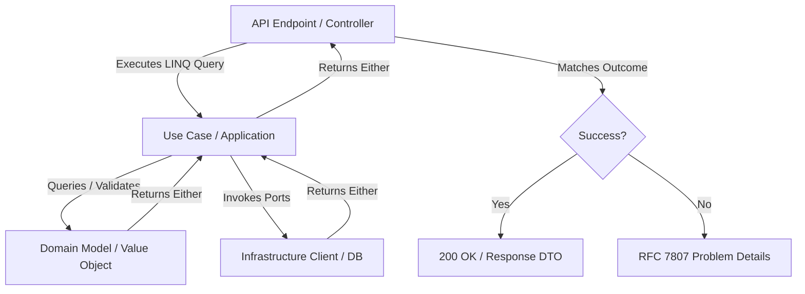

# Architecture & Project Structure Guide

This document outlines the architectural patterns, folder structures, and namespace guidelines across C# projects.

---

## 1. Architectural Overview

The codebase is built on **Clean Architecture** and **Domain-Driven Design (DDD)** principles, combined with a **Functional Programming (FP)** paradigm using the [LanguageExt](https://github.com/louthy/language-ext) library.

### Monadic Control Flow
Instead of relying on standard try-catch blocks or returning `null`, operations return the `Either<Error, T>` monad (or its asynchronous equivalent `EitherAsync<Error, T>`). This ensures:
- Safe, compile-time enforced error handling.
- Linear execution pipelines using LINQ query syntax.
- Clear separation of happy-path logic and error translation.



---

## 2. Directory Layout & Feature Slicing

Projects are separated by responsibilities (e.g., Web Host, Worker Host, Shared Common, and corresponding Test projects). Code within each project is organized strictly by feature/domain subdomain, using Clean Architecture layers and Vertical Feature Slicing.

### 2.1 Bounded Context Folder Structure
```
├── Common/                          # Shared library containing core domains
│   └── [DomainSubdomain]/          # e.g., OrderProcessing, Billing
│       └── [BoundedContext]/        # e.g., InvoiceGeneration
│           ├── Domain/              # Pure domain logic (no dependencies)
│           │   ├── Models/          # Entities and Value Objects
│           │   └── Ports/           # Interfaces for external dependencies (e.g., Repositories, API clients)
│           ├── Application/         # Orchestrates domain actions
│           │   ├── UseCases/        # Application logic, workflows, & command/query handlers
│           │   └── Contracts/       # Use case/application interfaces
│           └── Infrastructure/      # Framework-specific implementations
│               ├── Http/            # API clients calling external systems
│               ├── Cache/           # Caching layers
│               └── Settings/        # Options and dependency injection config
│
├── Common.Test/                     # Mirrors 'Common' project layout
│   └── [DomainSubdomain]/
│       └── [BoundedContext]/
│           ├── Domain/
│           │   ├── Models/          # Unit tests for domain models
│           │   └── Builders/        # Test data builders for unit tests
│           ├── Application/
│           │   └── UseCases/        # Unit tests for application use cases
│           └── Infrastructure/      # Integration and client tests
│
├── DomainProject.Internal.Web/      # Web API Gateway project
│   ├── Controllers/
│   │   └── V[Number]/               # API Versioning (e.g., V1, V2)
│   │       └── [Feature]/           # Controllers grouped by feature
│   └── Program.cs
│
└── DomainProject.Internal.Worker/   # Background processing / Event consumers
    ├── Consumers/
    │   └── V[Number]/               # Message brokers / event consumers
    └── Program.cs
```

### 2.2 Vertical Feature Slicing
Within a bounded context, features follow a logical folder hierarchy to maintain clear boundaries:
`[FeatureConcept]/[FeatureAction]/[Layer]`
- **`[FeatureConcept]`**: The high-level Aggregate or Feature area (e.g., `Order`, `Document`, `Invoice`).
- **`[FeatureAction]`**: The specific use case, operation, or event handler (e.g., `PlaceOrder`, `NotifyCustomer`, `ProcessPayment`).
- **`[Layer]`**: The architectural layer (`Domain`, `Application`, or `Infrastructure`).
- **Event Handlers**: Place Domain Event Handlers (handling events inside the same boundary) within the `Application` layer of the receiving slice.

---

## 3. Namespace Rules

Namespaces must match the directory path exactly to preserve consistency across modules:
- **Main Class Namespace**: `namespace Common.[DomainSubdomain].[BoundedContext].[Layer].[SubFolder];`
  - *Example:* `namespace Common.Billing.InvoiceGeneration.Domain.Models;`
- **Test Class Namespace**: `namespace Common.Test.[DomainSubdomain].[BoundedContext].[Layer].[SubFolder];`
  - *Example:* `namespace Common.Test.Billing.InvoiceGeneration.Domain.Models;`
