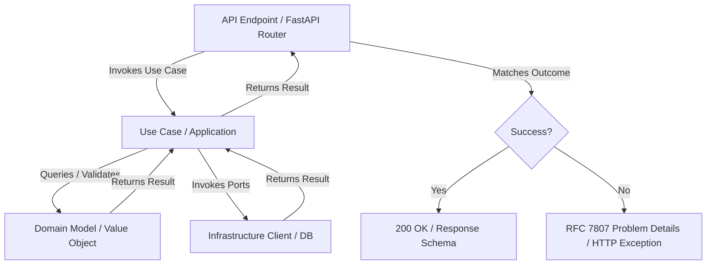

# Architecture & Project Structure Guide

This document outlines the architectural patterns, folder structures, and package guidelines across Python projects.

---

## 1. Architectural Overview

The codebase is built on **Clean Architecture** and **Domain-Driven Design (DDD)** principles, adapted to Python's conventions and combined with a **Functional Programming (FP)** paradigm using a lightweight monadic `Result` flow (`Success` / `Failure`).

### Monadic Control Flow
Instead of relying on standard try-catch blocks for business logic flow or returning `None`, operations return a `Result[Value, Error]` union (represented by `Success[Value]` and `Failure[Error]` classes). This ensures:
- Safe, type-checked error handling.
- Clear separation of happy-path logic and error handling/translation.
- Integration with Python 3.10+ structural pattern matching.



---

## 2. Directory Layout & Feature Slicing

Projects are separated by responsibilities (e.g., APIs, Workers, Core Packages, and corresponding Test packages). Code is organized strictly by feature/domain subdomain, using Clean Architecture layers and Vertical Feature Slicing.

### 2.1 Bounded Context Folder Structure
```
├── src/                             # Main application source
│   └── [domain_subdomain]/          # e.g., order_processing, billing (snake_case)
│       └── [bounded_context]/        # e.g., invoice_generation
│           ├── domain/              # Pure domain logic (no external dependencies)
│           │   ├── models/          # Entities and Value Objects
│           │   └── ports/           # Abstract base classes (interfaces) for repositories/clients
│           ├── application/         # Orchestrates domain actions
│           │   ├── use_cases/       # Application logic, workflows, & command/query handlers
│           │   └── contracts/       # Use case/application interfaces (if needed)
│           └── infrastructure/      # Framework-specific implementations
│               ├── http/            # API clients calling external systems
│               ├── cache/           # Caching layers
│               └── settings/        # Config, settings, and dependency injection
│
├── tests/                           # Mirrors 'src' project layout for tests
│   └── [domain_subdomain]/
│       └── [bounded_context]/
│           ├── domain/
│           │   ├── models/          # Unit tests for domain models
│           │   └── builders/        # Test data builders for unit tests
│           ├── application/
│           │   └── use_cases/       # Unit tests for application use cases
│           └── infrastructure/      # Integration and client tests
│
├── pyproject.toml                   # Poetry or Pipenv package metadata
└── README.md
```

### 2.2 Vertical Feature Slicing
Within a bounded context, features follow a logical folder hierarchy to maintain clear boundaries:
`[feature_concept]/[feature_action]/[layer]`
- **`[feature_concept]`**: The high-level Aggregate or Feature area (e.g., `order`, `document`, `invoice`).
- **`[feature_action]`**: The specific use case, operation, or event handler (e.g., `place_order`, `notify_customer`, `process_payment`).
- **`[layer]`**: The architectural layer (`domain`, `application`, or `infrastructure`).
- **Event Handlers**: Place Domain Event Handlers (handling events inside the same boundary) within the `application` layer of the receiving slice.

---

## 3. Package & Import Rules

To preserve architectural boundaries and prevent circular dependencies:
- **Absolute Imports**: Always use absolute imports starting from `src`.
  - *Example:* `from src.billing.invoice_generation.domain.models.invoice_id import InvoiceId`
- **Dependency Flow**: Imports must only point inward:
  - `domain` must never import from `application` or `infrastructure`.
  - `application` can import from `domain`, but never from `infrastructure`.
  - `infrastructure` can import from both `domain` and `application`.
