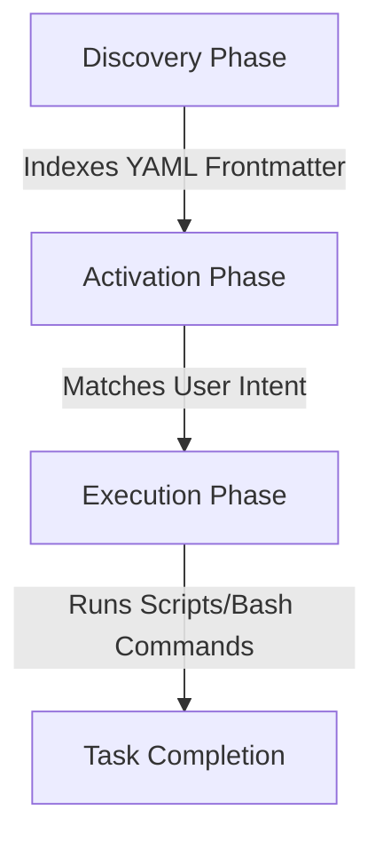

# Wolfremium Agents Configuration

This repository houses central, reusable standards, rules, and skills for autonomous AI development agents. By decoupling agent instructions from individual application codebases, we ensure consistency across projects while maintaining light, clean repositories.

The integration uses a **Symbolic Linking (Symlink)** approach combined with **Progressive Disclosure** and **Multi-Agent Orchestration**.

---

## 📂 Repository Structure

The project has the following layout:

*   **[.wolfremium-agents/](file:///home/wolfremium/Documents/kevin-hierro/wolfremium-agents-configuration/.wolfremium-agents)**: The central vault containing vertical slices of domain-specific instructions:
    *   **[chsarp/](file:///home/wolfremium/Documents/kevin-hierro/wolfremium-agents-configuration/.wolfremium-agents/chsarp)**: C# and general programming development rules and skills.
    *   **[discovery/](file:///home/wolfremium/Documents/kevin-hierro/wolfremium-agents-configuration/.wolfremium-agents/discovery)**: Discovery phase guidelines.
*   **[setup.sh](file:///home/wolfremium/Documents/kevin-hierro/wolfremium-agents-configuration/setup.sh)**: An interactive bootstrapping shell script that links agent configurations into the active workspace.
*   **.agents/**: The target directory generated by `setup.sh` containing current active configurations (ignored by Git).

---

## 🚀 Getting Started (Setup & Usage)

To bootstrap your workspace with the desired agent configurations:

1.  **Clone or place** this repository at the root of your target project.
2.  **Run the setup script** to select which slices you want to import:
    ```bash
    ./setup.sh
    ```
3.  **Choose the slices** you wish to enable:
    *   Select one or more folders by entering space-separated numbers (e.g., `1 2`).
    *   Select `a` to import all folders.
    *   Select `c` to cancel.

> [!NOTE]
> Running the setup script automatically cleans up existing symlinks inside `.agents/` first. This guarantees you will not have leftover or orphaned configurations when changing your active slices.

---

## ⚙️ Core Architecture & Design Patterns

### 1. Symlink Integration
Rather than copying configuration files across multiple repositories, [setup.sh](file:///home/wolfremium/Documents/kevin-hierro/wolfremium-agents-configuration/setup.sh) creates symbolic links (`ln -s`) from the project's local `.agents/skills/` and `.agents/rules/` directories to the specific folders inside the isolated `.wolfremium-agents/` vault.

*   **Workspace Scope Integration**: Establishes local configurations without polluting commits.
*   **Git Cleanliness**: `.agents/` is automatically ignored in the project's `.gitignore` to prevent committing local agent state.

### 2. Context Optimization & Progressive Disclosure
Once links are created, the Antigravity agent engine natively loads these skills without overloading the LLM's context window. It follows a three-phase lifecycle:



*   **Discovery Phase**: When the project is opened, only the YAML frontmatter of symlinked `SKILL.md` files is indexed. This consumes only ~100 tokens per skill, keeping the workspace catalog highly lightweight.
*   **Activation Phase**: When a user prompt matches a skill description in the YAML, the engine dynamically injects the full markdown instructions into the active context.
*   **Execution Phase**: The agent executes the instructions, which can cleanly invoke deterministic local bash or python scripts located in the skill's `scripts/` directory.

---

## 🤖 Multi-Agent Orchestrator Integration

To satisfy requirements where different models handle different tasks (e.g., heavy models for planning and fast/local models for running scripts), you can integrate **Control Primitives** from the Agent Development Kit (ADK) into your execution workflows:

### 🧩 Available Primitives

*   **`SequentialAgent`**: Runs specialized sub-agents linearly. It guarantees that the output of your high-effort planning agent is cleanly passed into the context window of your low-effort execution/scripting agent.
*   **`LoopAgent`**: Standardizes autonomous self-correction cycles (e.g., test/lint validation loops). It pairs an execution agent with a judge agent, looping until the judge passes or limits are hit.
*   **State-Based Handoffs**: Fully decouples agents using repository labels (e.g., GitHub PR tags). An Architect agent plans and tags `ready-for-dev`, signaling a local Engineer agent to run the scripts asynchronously.
