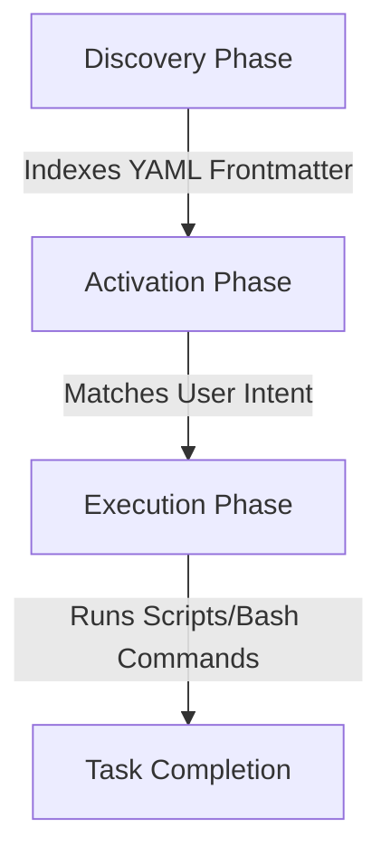

# Wolfremium Agents Configuration Plugin

This repository houses central, reusable standards, rules, and skills for autonomous AI development agents. It is structured as a native **Antigravity CLI Plugin**, enabling seamless installation and global activation of specialized agents, skills, and coding standards.

---

## 📂 Repository Structure

The project has the following layout:

*   **`plugin.json`**: The plugin manifest file identifying this directory as an Antigravity plugin.
*   **[agents/](file:///home/wolfremium/Documents/kevin-hierro/wolfremium-agents-configuration/agents)**: Specialized subagent definition templates:
    *   `cs-developer` & `cs-reviewer`: C# specialized developer and reviewer agents.
    *   `py-developer` & `py-reviewer`: Python specialized developer and reviewer agents.
*   **[skills/](file:///home/wolfremium/Documents/kevin-hierro/wolfremium-agents-configuration/skills)**: Custom skills implementing Clean Architecture, DDD, and language-specific workflows.
*   **[rules/](file:///home/wolfremium/Documents/kevin-hierro/wolfremium-agents-configuration/rules)**: Codebase rules enforcing guidelines like architecture, coding style, naming, and testing (prefixed with `cs-` or `py-`).

---

## 🚀 Getting Started (Installation & Usage)

To install this plugin on your local **Antigravity CLI** environment:

1.  **Clone the repository** from GitHub:
    ```bash
    git clone https://github.com/your-username/wolfremium-agents-configuration.git
    ```
2.  **Install the plugin** using the Antigravity CLI:
    ```bash
    agy plugin install ./wolfremium-agents-configuration
    ```
3.  **Verify the installation**:
    ```bash
    agy plugin list
    ```

Once installed, the CLI automatically discovers and registers the plugin's skills and agents.

---

## ⚙️ Core Architecture & Features

### 1. Zero-Footprint Workspace Setup
Unlike symbolic link approaches, this native plugin model loads configurations globally via the Antigravity CLI without copying files or polluting your project commits with local agent state files.

### 2. Context Optimization & Progressive Disclosure
Once the plugin is installed, Antigravity natively loads these skills without overloading the LLM's context window. It follows a three-phase lifecycle:



*   **Discovery Phase**: When a project is opened, only the YAML frontmatter of the plugin's skills is indexed. This consumes minimal tokens, keeping the workspace catalog lightweight.
*   **Activation Phase**: When a user prompt matches a skill description, the engine dynamically injects the full markdown instructions into the active context.
*   **Execution Phase**: The agent executes the instructions, invoking deterministic local scripts as needed.

---

## 🤖 Multi-Agent Orchestrator Integration

To satisfy requirements where different models handle different tasks (e.g., heavy models for planning and fast/local models for running scripts), you can integrate **Control Primitives** from the Agent Development Kit (ADK) into your execution workflows:

### 🧩 Available Primitives

*   **`SequentialAgent`**: Runs specialized sub-agents linearly. It guarantees that the output of your high-effort planning agent is cleanly passed into the context window of your low-effort execution/scripting agent.
*   **`LoopAgent`**: Standardizes autonomous self-correction cycles (e.g., test/lint validation loops). It pairs an execution agent with a judge agent, looping until the judge passes or limits are hit.
*   **State-Based Handoffs**: Fully decouples agents using repository labels (e.g., GitHub PR tags). An Architect agent plans and tags `ready-for-dev`, signaling a local Engineer agent to run the scripts asynchronously.
