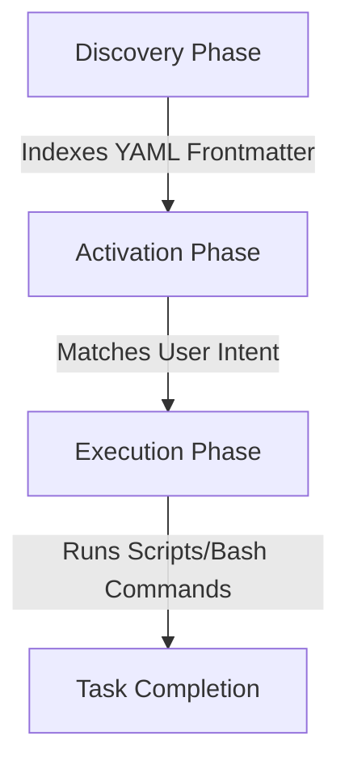

# Wolfremium Agents Configuration Plugin

This repository houses central, reusable standards, rules, and skills for autonomous AI development agents. It is structured as a native **Antigravity CLI Plugin**, enabling seamless installation and global activation of specialized agents, skills, and coding standards.

---

## 📂 Repository Layout & Component Links

*   **Plugin Manifest**:
    *   [`plugin.json`](file:///home/wolfremium/Documents/kevin-hierro/wolfremium-agents-configuration/plugin.json) - Defines the plugin metadata (name, version, description).

*   **🤖 Specialized Subagents**:
    Specialized agent profiles containing model configurations, rules, and custom skills:
    *   **C# Agents**:
        *   [`cs-developer`](file:///home/wolfremium/Documents/kevin-hierro/wolfremium-agents-configuration/agents/cs-developer/agent.json) - Profile for building Clean Architecture & DDD components in C#.
        *   [`cs-reviewer`](file:///home/wolfremium/Documents/kevin-hierro/wolfremium-agents-configuration/agents/cs-reviewer/agent.json) - Profile for auditing C# codebases for compliance.

*   **⚡ Custom Skills**:
    Executable workflows with detailed instruction manuals and script bindings:
    *   **C# Skills**:
        *   [`cs-create-project`](file:///home/wolfremium/Documents/kevin-hierro/wolfremium-agents-configuration/skills/cs-create-project/SKILL.md) - Plan and scaffold projects and components.
        *   [`cs-lint-project`](file:///home/wolfremium/Documents/kevin-hierro/wolfremium-agents-configuration/skills/cs-lint-project/SKILL.md) - Scan codebase and enforce compliance rules.
        *   [`cs-normalize-project`](file:///home/wolfremium/Documents/kevin-hierro/wolfremium-agents-configuration/skills/cs-normalize-project/SKILL.md) - Automatically format and refactor files.

*   **📘 Architectural & Design Rules**:
    Mandatory design rules loaded directly into agent contexts:
    *   **C# Rules**:
        *   [`cs-architecture.md`](file:///home/wolfremium/Documents/kevin-hierro/wolfremium-agents-configuration/rules/cs-architecture.md)
        *   [`cs-coding-style.md`](file:///home/wolfremium/Documents/kevin-hierro/wolfremium-agents-configuration/rules/cs-coding-style.md)
        *   [`cs-comments.md`](file:///home/wolfremium/Documents/kevin-hierro/wolfremium-agents-configuration/rules/cs-comments.md)
        *   [`cs-domain-driven-design.md`](file:///home/wolfremium/Documents/kevin-hierro/wolfremium-agents-configuration/rules/cs-domain-driven-design.md)
        *   [`cs-naming.md`](file:///home/wolfremium/Documents/kevin-hierro/wolfremium-agents-configuration/rules/cs-naming.md)
        *   [`cs-testing.md`](file:///home/wolfremium/Documents/kevin-hierro/wolfremium-agents-configuration/rules/cs-testing.md)

---

## 🚀 Installation & Usage

To install this plugin globally on your local **Antigravity CLI** environment:

1.  **Clone the repository**:
    ```bash
    git clone https://github.com/your-username/wolfremium-agents-configuration.git
    ```
2.  **Install the plugin**:
    ```bash
    agy plugin install ./wolfremium-agents-configuration
    ```
3.  **Verify the installation**:
    ```bash
    agy plugin list
    ```

Once installed, the CLI automatically discovers and registers the plugin's skills and agents.

---

## ⚙️ Core Architecture & Features

### 1. Zero-Footprint Workspace Setup
Unlike symbolic link approaches, this native plugin model loads configurations globally via the Antigravity CLI without copying files or polluting your project commits with local agent state files.

### 2. Context Optimization & Progressive Disclosure
Once the plugin is installed, Antigravity natively loads these skills without overloading the LLM's context window. It follows a three-phase lifecycle:



*   **Discovery Phase**: When a project is opened, only the YAML frontmatter of the plugin's skills is indexed. This consumes minimal tokens, keeping the workspace catalog lightweight.
*   **Activation Phase**: When a user prompt matches a skill description, the engine dynamically injects the full markdown instructions into the active context.
*   **Execution Phase**: The agent executes the instructions, invoking deterministic local scripts as needed.

---

## 🤖 Multi-Agent Orchestrator Integration

To satisfy requirements where different models handle different tasks (e.g., heavy models for planning and fast/local models for running scripts), you can integrate **Control Primitives** from the Agent Development Kit (ADK) into your execution workflows:

### 🧩 Available Primitives

*   **`SequentialAgent`**: Runs specialized sub-agents linearly. It guarantees that the output of your high-effort planning agent is cleanly passed into the context window of your low-effort execution/scripting agent.
*   **`LoopAgent`**: Standardizes autonomous self-correction cycles (e.g., test/lint validation loops). It pairs an execution agent with a judge agent, looping until the judge passes or limits are hit.
*   **State-Based Handoffs**: Fully decouples agents using repository labels (e.g., GitHub PR tags). An Architect agent plans and tags `ready-for-dev`, signaling a local Engineer agent to run the scripts asynchronously.
