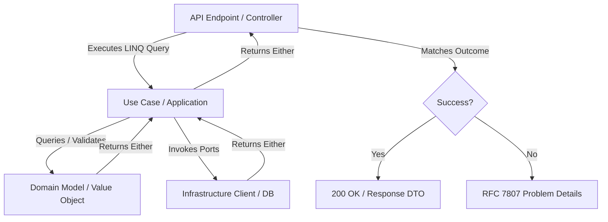

# Architecture & Project Structure Guide

This document outlines the architectural patterns, folder structures, and namespace guidelines across C# projects.

---

## 1. Architectural Overview

The codebase is built on **Clean Architecture** and **Domain-Driven Design (DDD)** principles, combined with a **Functional Programming (FP)** paradigm using the [LanguageExt](https://github.com/louthy/language-ext) library.

### Monadic Control Flow
Instead of relying on standard try-catch blocks or returning `null`, operations return the `Either<Error, T>` monad (or its asynchronous equivalent `EitherAsync<Error, T>`). This ensures:
- Safe, compile-time enforced error handling.
- Linear execution pipelines using LINQ query syntax.
- Clear separation of happy-path logic and error translation.

#### Core Rules:
1. **No Exceptions for Control Flow**: Do not use or throw exceptions to handle errors or control flow in production code. Use the `Either` library exclusively. The **only** exception is inside the test project within Test Data Builders, which may throw exceptions when unable to construct a valid object.
2. **Ports Manage Either for Errors**: All Port interfaces (e.g., Repositories, HTTP clients, Event publishers) must return `Either<Error, T>` or `EitherAsync<Error, T>` to explicitly model operations that can fail.



---

## 2. Directory Layout & Feature Slicing

Projects are separated by responsibilities (e.g., Web Host, Worker Host, Shared Common, and corresponding Test projects). Code within each project is organized strictly by feature/domain subdomain, using Clean Architecture layers and Vertical Feature Slicing.

### 2.1 Bounded Context Folder Structure
To maximize maintainability and keep files small, the project uses a `[BoundedContext]/[Action]/[Layer]` structure rather than grouping layers at the Bounded Context root:

```
├── Common/                          # Shared library containing core domains
│   └── [DomainSubdomain]/          # e.g., OrderProcessing, Billing
│       └── [BoundedContext]/        # e.g., Users, Invoices
│           └── [Action]/            # e.g., Register, ProcessPayment
│               ├── Domain/          # Pure domain logic (no dependencies)
│               │   ├── Models/      # Entities and Value Objects specific to this action
│               │   └── Ports/       # Interfaces for external dependencies returning Either
│               ├── Application/     # Orchestrates domain actions
│               │   ├── Contracts/   # Use case contracts (interfaces) and associated commands/queries
│               │   └── UseCases/    # Application logic, workflows, & command/query handlers
│               └── Infrastructure/  # Framework-specific implementations
│                   ├── Http/        # API clients calling external systems
│                   ├── Cache/       # Caching layers
│                   └── Settings/    # Options and dependency injection config
│
├── Common.Test/                     # Mirrors 'Common' project layout
│   └── [DomainSubdomain]/
│       └── [BoundedContext]/
│           └── [Action]/
│               ├── Domain/
│               │   ├── Models/      # Unit tests for domain models
│               │   └── Builders/    # Test data builders for unit tests (can throw exceptions)
│               ├── Application/
│               │   └── UseCases/    # Unit tests for application use cases
│               └── Infrastructure/  # Integration and client tests
│
├── DomainProject.Internal.Web/      # Web API Gateway project
│   ├── Controllers/
│   │   └── V[Number]/               # API Versioning (e.g., V1, V2)
│   │       └── [BoundedContext]/    # Grouped by bounded context (e.g., Users)
│   │           └── [BoundedContext][Action]Should.cs # Single-method controllers
│   └── Program.cs
│
└── DomainProject.Internal.Worker/   # Background processing / Event consumers
    ├── Consumers/
    │   └── V[Number]/               # Message brokers / event consumers
    └── Program.cs
```

### 2.2 Web API Controllers
- **Single Method Only**: All controllers must be design-focused and implement exactly **one** public action method (REPR pattern).
- **Naming Convention**: The controller class and file must be named following the pattern `<original-name><action>Should.cs` (e.g., `Users/V1/UserRegisterShould.cs` containing the `UserRegisterShould` controller class).

### 2.3 Dependency Injection & Configuration encapsulation
- **Inject via Extensions**: Always create extension methods (e.g., `IServiceCollection` extension methods) to encapsulate and hide how infrastructure, services, or settings are injected.
- **Clean Program.cs**: Do not register individual services or parse settings directly in `Program.cs`. Keep `Program.cs` high-level and clean by invoking these extension methods.

### 2.4 Application Contracts & Commands
- **Contracts Folder**: Ensure a `Contracts/` folder is created on the application layer (`Application/Contracts/`) to contain the use case contracts.
- **Do Not Group Contracts**: Do not group multiple application/use case contracts (interfaces) in a single file. Each contract must have its own dedicated file (e.g., `IRegisterUser.cs`) inside the `Contracts/` folder.
- **Command Positioning**: Define the Command or Request record/DTO associated with a specific use case contract directly within the same file, positioned immediately below the contract interface definition (e.g., place `RegisterUserCommand` right below `IRegisterUser`).

---

## 3. Namespace Rules

Namespaces must match the directory path exactly to preserve consistency across modules:
- **Main Class Namespace**: `namespace Common.[DomainSubdomain].[BoundedContext].[Action].[Layer].[SubFolder];`
  - *Example:* `namespace Common.Billing.Users.Register.Domain.Models;`
- **Test Class Namespace**: `namespace Common.Test.[DomainSubdomain].[BoundedContext].[Action].[Layer].[SubFolder];`
  - *Example:* `namespace Common.Test.Billing.Users.Register.Domain.Models;`
